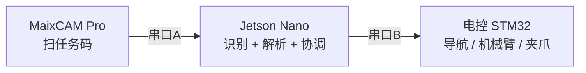
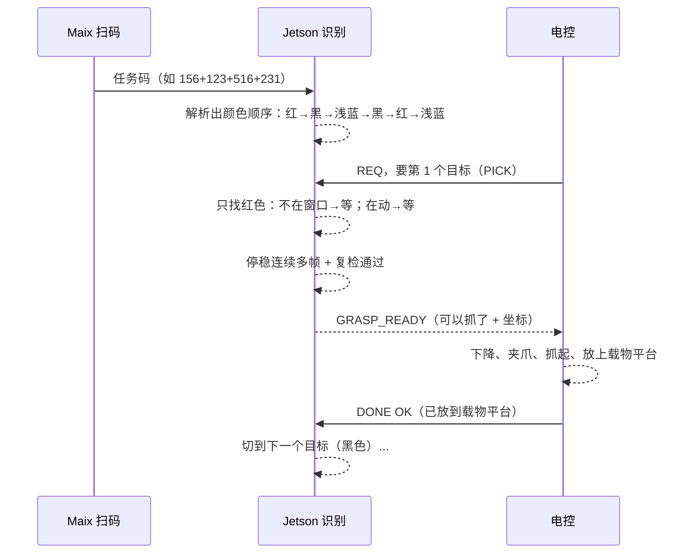

# 新手入门：整体流程与使用指南

> 第一次接触这套视觉代码？从这一份开始。它不讲高深算法，只讲清楚三件事：
> 系统由什么组成、整体怎么跑、两块板子怎么一步步测。
> 看完这份，再去翻 `docs/05`（分板测试细节）和 `docs/06`（协调层协议）会轻松很多。

---

## 1. 这套系统是干嘛的

比赛任务一句话：**机器人自动扫码 → 去原料区按颜色抓物料 → 放到指定圆环 → 第二批再码垛。**

整个机器人分两大块：

- **电控负责**：导航、走位、避障、机械臂、夹爪（**你不写，也不用管**）；
- **视觉负责**（本项目）：用"眼睛"看东西（识别），并把结果告诉别人（通信）。

视觉用了两块板，分工明确：

| 板子 | 相机 | 负责什么 | 一句话 |
|---|---|---|---|
| **Jetson Nano** | OG05B10（USB） | 认物料颜色、圆环、转盘、码垛 | "目标在哪、能不能抓" |
| **MaixCAM Pro** | 自带摄像头 | 扫二维码，读出任务码 | "这局要抓哪些颜色" |

两块板之间、以及 Jetson 和电控之间，都靠**串口（UART）**通信。



---

## 2. 整体流程（先看这张图）



用大白话再过一遍：

1. **Maix 扫码**：机器人开到二维码板前，Maix 读出任务码，发给 Jetson；
2. **Jetson 解析**：把任务码变成"按什么顺序抓什么颜色"（两批，每批 3 个）；
3. **电控问，Jetson 答**：电控把车开到原料区，发"我要第 1 个目标"；
4. **Jetson 只找这一个颜色**：转盘上没它→继续等；它来了还在转→继续等；它停稳、连续多帧不动、再复检一遍→告诉电控"可以抓了 + 坐标在这"；
5. **电控抓 → 放平台 → 报结果**：电控下降抓取，把物料放到**车上的载物平台**上，放好之后
   才发"成功"；Jetson 收到才切下一个颜色；抓取或放置失败则重试几次。

> 关键设计：**Jetson 一次只找一个目标颜色**（按任务码顺序来），而不是一次性认 6 种。
> 这样不会认错，也符合"按顺序抓"的比赛规则。

---

## 3. 测试前：需要哪些硬件

| 硬件 | 用途 | 备注 |
|---|---|---|
| Jetson Nano + 电源 | 跑识别 | 建议配散热 |
| OG05B10 USB 相机 | Jetson 的眼睛 | 或任意 UVC 相机先用着 |
| MaixCAM Pro + Type-C 线 | 跑扫码 | 连电脑用 MaixVision |
| 2 个 USB 转串口模块 | 通信 | 必须 3.3V TTL 电平 |
| 杜邦线若干 | 接线 | |
| 一台电脑（Win11 笔记本） | SSH 连 Jetson、看串口 | |

电脑和 Jetson 通常用网线/同一 WiFi 做 SSH；电脑通过 USB 转串口看串口输出。

---

## 4. 三种测试模式总览（先选你要哪种）

| 模式 | 测什么 | 最少需要 | 去哪看 |
|---|---|---|---|
| ① **Jetson 单独测** | Jetson 识别准不准 | Jetson + 相机（或一张照片） | 第 5 节 |
| ② **Maix 单独测** | Maix 扫码准不准 | Maix 一块板 | 第 6 节 |
| ③ **联合测（两板）** | 扫码结果能不能传到 Jetson | 两块板 + 1 根串口线 | 第 7 节 |
| ④ **联合测（+电控）** | 整机闭环 | 两块板 + 2 根串口线 + 电控 | 第 8 节 |

**新手推荐路线**：先 ②（最简单，只用一块板）→ 再 ①（Jetson 用照片最省事）→
最后 ③ ④（需要接线）。别一上来就整机联调。

---

## 5. 模式①：Jetson 单独测试

> 目标：确认 Jetson 能"看见目标、给坐标"。
> 不需要 Maix，也不需要电控。

### 5.1 连上 Jetson

电脑 SSH 到 Jetson，把 `standalone_vision` 目录传过去（或克隆），然后：

```bash
cd standalone_vision
sudo apt update
sudo apt install -y python3-opencv python3-numpy python3-pip v4l-utils
python3 -m pip install --user -r requirements-jetson.txt
```

### 5.2 告诉程序相机是哪个

插上 OG05B10，查设备名：

```bash
v4l2-ctl --list-devices
ls -l /dev/v4l/by-id/
```

把结果填进 `config/jetson.json` 的 `camera.device`（用 `/dev/v4l/by-id/...` 那种，最稳）。

### 5.3 最快验证：用一张照片测（不用相机）

把一张有红色物料的照片放到板子上，执行：

```bash
python3 -m jetson_recognition.run image red.jpg \
  --mode COLOR --scene ROUGH --target 1 --show
```

- `--target 1` = 找红色（1红 2黄 3蓝 4绿 5黑 6浅蓝）
- 有图形界面会弹出窗口；SSH 无桌面就把 `--show` 换成 `--save result.jpg`

**预期看到**：画面上十字标在红色物料中心，终端打印坐标和置信度。

### 5.4 接相机实时测

```bash
python3 -m jetson_recognition.run live \
  --mode COLOR --scene TURNTABLE --target 1 --camera /dev/video0
```

窗口里按 `q` 退出。**预期看到**：物料一停稳，状态变成 `STABLE`。

### 5.5 测"等转盘抓取"（pickup，最接近实战）

先标定抓取窗口（没标定会报错）：

```bash
python3 tools/capture_zone_calibrator.py --camera 0 --target 1 --scene TURNTABLE
```

在弹出的窗口里**左键拖一个框**，把夹爪要抓的位置框住（黄色外框 + 绿色内框），按 `s` 保存。

然后：

```bash
python3 -m jetson_recognition.run pickup --target 1 --scene TURNTABLE
```

**预期看到状态变化**：`SEARCHING`（窗口里没红）→ `MOVING`（红了但在动）→
`SETTLING`（慢了/停了）→ `FINAL_CHECK`（复检）→ `GRASP_READY`（可以抓了）。

### 5.6 可选：把识别结果从串口发出去

```bash
python3 -m jetson_recognition.run \
  --serial /dev/ttyUSB0 \
  live --mode COLOR --scene TURNTABLE --target 1 --headless
```

> `--serial` 要写在 `live` 前面。不写就不开串口，只在终端打印。

---

## 6. 模式②：Maix 单独测试

> 目标：确认 Maix 能扫出任务码。**只用一块板，最简单。**

### 6.1 用 MaixVision 打开项目

1. 电脑上打开 MaixVision，新建项目；
2. 把 `maixcam_pro/config.py` 和 `maixcam_pro/main.py` 放进去；
3. 连上 MaixCAM Pro，点运行。

### 6.2 看屏幕（默认就是板载显示）

- 没扫到码：屏幕显示 `SEARCHING QR`；
- 扫到**格式不对**的码：显示 `INVALID QR`；
- 扫到**合法任务码**（四组三位数，如 `123+123+456+231`）：框变绿/黄，显示确认帧数 `4/4`；
- 连续几帧都一致：终端打印 `QR_STABLE payload=...`。

### 6.3 验证扫码稳定

拿手机/打印的二维码反复试：快速移动、倾斜、反光、离开画面再回来。
**预期**：只有连续 4 帧相同的合法码才 `QR_STABLE`，离开画面后状态会清空。

### 6.4 可选：开串口输出

改 `maixcam_pro/config.py`：

```python
SERIAL_ENABLED = True
```

重新运行。接上 USB 转串口（Maix 的 A19=TX、A18=RX，和电脑 RX/TX **交叉**接，共地），
电脑串口工具里能看到：

```text
@MAIX_QR,123+123+456+231,320.0,240.0,120.0,4,STABLE*XXXX
```

---

## 7. 模式③：联合测试 —— Maix 扫码结果发给 Jetson（bridge）

> 目标：确认"Maix 扫的码能传到 Jetson"。
> 接线只需 1 根串口线。

### 7.1 接线

```text
Maix A19 (TX)  ──> Jetson 的 USB转串口 RX
Maix A18 (RX)  ──< Jetson 的 USB转串口 TX
地线接在一起（共地）
```

> 电平必须 3.3V，别接 5V。

### 7.2 Jetson 跑 bridge

```bash
python3 -m jetson_recognition.run bridge --in-serial /dev/ttyUSB0
```

### 7.3 扫一个码，看结果

用 Maix 扫一个合法任务码。**Jetson 终端预期输出**：

```json
{"frame": "MAIX_QR", "fields": ["123+123+456+231", "320.0", "240.0", "120.0", "4", "STABLE"]}
```

说明扫码结果成功传到了 Jetson。

---

## 8. 模式④：联合测试 —— 视觉 + 电控整机闭环（coordinator）

> 目标：完整跑"扫码 → 解析 → 电控要目标 → Jetson 找 → 可抓许可"。
> 这是正式比赛时的形态：**电控负责导航/抓取，Jetson 只负责识别和通信。**

### 8.1 接线（两条串口）

```text
Maix A19/A18  ──> Jetson USB转串口 A   （maix_serial：收任务码）
Jetson USB转串口 B  <──> 电控 UART      （mcu_serial：双向命令）
OG05B10 USB ──> Jetson                   （相机）
```

### 8.2 填配置

在 `config/jetson.json` 的 `coordinator` 段里填两条串口设备名（用 `ls -l /dev/serial/by-id/` 查）。
并先用 `tools/capture_zone_calibrator.py` 标定 `capture_zone_px`。

### 8.3 启动

```bash
python3 -m jetson_recognition.run coordinator
```

启动后打印 `{"state":"COORDINATOR_READY",...}`。

### 8.4 从头到尾走一遍

| 谁 | 发什么 / 做什么 | Jetson 回什么 |
|---|---|---|
| Maix | 扫到任务码 | （内部解析成颜色队列） |
| 电控 | `START,RUN001` | `READY,RUN001` |
| 电控 | `REQ,0001,PICK` | `ACCEPTED,0001,PICK` → 等目标 |
| Jetson | 找到并停稳、复检通过 | `GRASP_READY,0001,1,550.000,350.000,PX,...` |
| 电控 | 抓取并放到载物平台后：`DONE,0001,OK` | `DONE_ACK,0001,OK` |
| 电控 | `REQ,0002,PICK`（要下一个） | 自动切到黑色，继续... |

没有电控时，可以用电脑串口工具/脚本模拟电控发命令，验证 Jetson 行为。
完整协议逐帧说明见 `docs/06_协调层通信协议与部署.md`。

---

## 9. 常用词解释（遇到不懂先查这里）

| 词 | 什么意思 |
|---|---|
| `STABLE` | 目标连续多帧位置都差不多，视觉认为它"停稳了" |
| `GRASP_READY` | 停稳 + 在抓取窗口 + 复检通过，视觉说"可以抓了" |
| `ROI` | 我只在画面里这一块区域找，减少误报 |
| `HSV` | 颜色的另一种表示，用来"只认红色"这类阈值 |
| `capture_zone` | 抓取窗口：目标中心必须进到这里面才给抓 |
| 标定 | 把"像素坐标"换算成"机器人毫米坐标"；没标定时单位是 `PX`，电控不能拿 PX 去动作 |
| `CRC` | 串口帧末尾的校验，用来发现传输出错 |
| `--headless` | 没有屏幕/图形界面的模式，结果打印成 JSON |

## 10. 给新手的推荐路线

1. **先读这份文档的第 1、2 节**，搞清楚谁干什么；
2. **做模式②**（Maix 扫码，最简单，10 分钟见效）；
3. **做模式①**（Jetson 先用照片，再用相机）；
4. **做模式③**（两板传任务码）；
5. 最后，等电控那边就绪了，一起做**模式④**整机联调。

每一步都有预期结果，卡住了就回来看第 9 节术语表，或对照 `docs/05` 的排查表。
